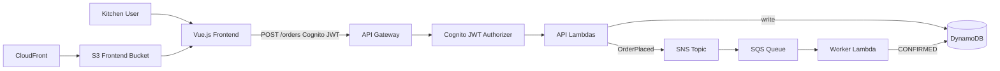

# Food Ordering — Serverless API + Vue Frontend

A kitchen ingredient ordering demo built for the Collectiv Food interview stack: **Vue.js**, **Node.js/TypeScript**, **AWS Lambda**, **API Gateway**, **DynamoDB**, **SNS/SQS**, **Terraform**, and **GitHub Actions CI**.

## Architecture



## Features

- **POST /orders** — place an ingredient order (JWT required)
- **GET /orders/{id}** — fetch order by ID
- **GET /orders** — list all orders
- **Vue.js UI** — sign in with AWS Cognito, place orders, refresh live order status
- **Async processing** — SNS publishes `OrderPlaced`, SQS triggers worker Lambda to confirm orders
- **AWS Cognito auth** — login/signup UI; API Gateway validates Cognito ID tokens
- **SOLID design** — handlers → services → repositories
- **Unit tests** — Jest with mocked AWS clients

## Tech stack

| Layer | Technology |
|-------|------------|
| Frontend | Vue 3, Vite, TypeScript |
| Frontend hosting | S3 + CloudFront |
| Runtime | Node.js 20, TypeScript |
| Compute | AWS Lambda |
| API | API Gateway HTTP API |
| Database | DynamoDB (on-demand) |
| Messaging | SNS + SQS (+ DLQ) |
| IaC | Terraform |
| CI | GitHub Actions |
| Auth | AWS Cognito + API Gateway JWT authorizer |

## Quick start (local)

```bash
npm install
npm --prefix frontend install
npm run ci          # backend lint + typecheck + test + build, then frontend build
```

Run the frontend locally (uses `frontend/.env.development`):

```bash
npm --prefix frontend run dev
```

### Sign in

Use the built-in login screen. A demo account is created by Terraform:

- **Email:** `demo@kitchen.com`
- **Password:** `DemoKitchen1!`

You can also click **Sign up** to create your own kitchen account (set a Kitchen ID during registration).

Live app: run `terraform output frontend_url` after deploy.

## Deploy to AWS

### Prerequisites

1. [AWS CLI](https://aws.amazon.com/cli/) configured (`aws configure`)
2. [Terraform](https://www.terraform.io/downloads) >= 1.0
3. Node.js 20+

### Steps

```bash
# 1. Build Lambda bundles and Vue frontend
npm run build
npm --prefix frontend run build

# 2. Configure Terraform (optional — defaults work for demo)
cp terraform/terraform.tfvars.example terraform/terraform.tfvars

# 3. Deploy infrastructure
cd terraform
terraform init
terraform plan
terraform apply

# 4. Build frontend with Cognito settings from Terraform
@"
VITE_API_URL=$(terraform -chdir=terraform output -raw api_url)
VITE_COGNITO_USER_POOL_ID=$(terraform -chdir=terraform output -raw cognito_user_pool_id)
VITE_COGNITO_CLIENT_ID=$(terraform -chdir=terraform output -raw cognito_client_id)
"@ | Set-Content frontend/.env.production
npm --prefix frontend run build

# 5. Note outputs and upload frontend
terraform output api_url
terraform output frontend_bucket_name
terraform output frontend_url
```

Upload the Vue build to S3:

```bash
aws s3 sync frontend/dist "s3://$(terraform -chdir=terraform output -raw frontend_bucket_name)" --delete
```

### Smoke test

Sign in at the frontend URL, create an order, and refresh until status becomes `CONFIRMED`.

Or test the API with a Cognito ID token from the login flow.

After a few seconds, the worker Lambda processes the SQS message and updates the order status from `PENDING` to `CONFIRMED`.

## Automatic deployment (GitHub Actions)

Every push to `master` runs tests, then deploys to AWS automatically.

### One-time setup

1. **Terraform state** (already configured):
   - S3 bucket: `food-ordering-terraform-state-631026310596-us-east-1-an` (`us-east-1`)
   - S3 native state locking (`use_lockfile`)
   - App resources still deploy to `eu-west-2`

2. **GitHub secrets** — add at [Repository Settings → Secrets](https://github.com/gindriliunas/food-ordering/settings/secrets/actions):
   - `AWS_ACCESS_KEY_ID`
   - `AWS_SECRET_ACCESS_KEY`

   Use an IAM user with permissions for Lambda, API Gateway (admin, not invoke-only), DynamoDB, SNS, SQS, Cognito, S3, CloudFront, and IAM. Example managed policies:

   - `AWSLambda_FullAccess`
   - `AmazonAPIGatewayAdministrator` (not `AmazonAPIGatewayInvokeFullAccess`)
   - `AmazonDynamoDBFullAccess`
   - `AmazonSNSFullAccess`
   - `AmazonSQSFullAccess`
   - `AmazonCognitoPowerUser`
   - `AmazonS3FullAccess`
   - `CloudFrontFullAccess`
   - `IAMFullAccess` (Terraform creates Lambda execution roles)

   IAM users are limited to **10 attached policies** — remove unused ones before adding new.

3. **Push to master** — the `deploy` job in `.github/workflows/ci.yml` will:
   - Run `terraform apply` (using remote state in S3)
   - Build the Vue frontend with live Cognito/API URLs
   - Upload to S3 and invalidate CloudFront

Pull requests only run build/test — no deploy.

## Project structure

```
src/
  handlers/       # Lambda entry points
  services/       # Business logic
  repositories/   # DynamoDB access
  lib/            # Auth, validation, responses
  types/          # Domain types
frontend/
  src/             # Vue components, API client, frontend types
tests/            # Jest unit tests
terraform/        # AWS infrastructure
.github/workflows/ci.yml
```

## Interview talking points

1. **Domain fit** — mirrors Collectiv Food's supply chain: kitchens place orders, events flow async through messaging
2. **Full-stack AWS demo** — Vue.js hosted on S3/CloudFront calls a serverless TypeScript API
3. **SOLID** — `OrderService` depends on `OrderRepository` interface, not DynamoDB directly
4. **TDD** — validation and service logic covered by unit tests before integration
5. **Event-driven** — SNS decouples API from fulfilment; SQS gives retries + DLQ for failed messages
6. **Security** — AWS Cognito handles users/passwords; API Gateway validates tokens
7. **CI/CD** — GitHub Actions builds and verifies both backend and frontend
8. **Cost** — serverless + on-demand DynamoDB stays within AWS free tier for demos

## Cleanup

```bash
cd terraform
terraform destroy
```

## License

MIT
