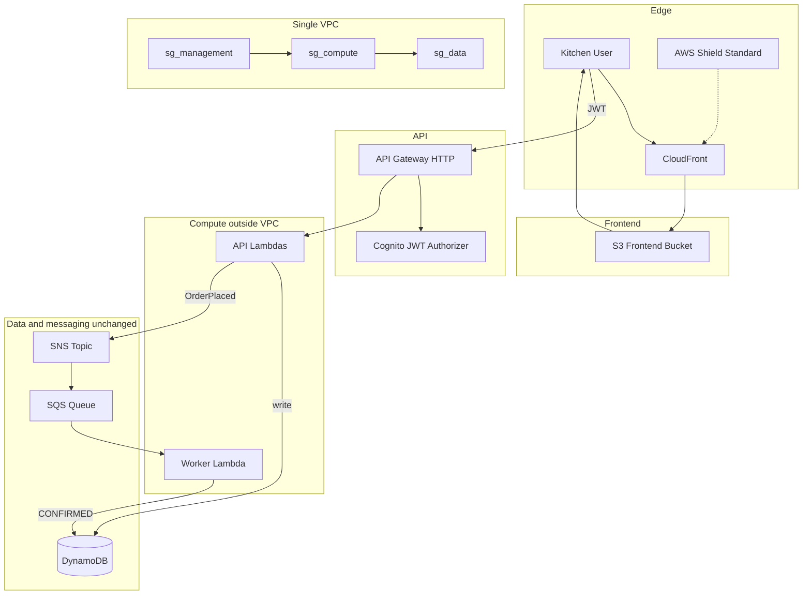

# Food Ordering — Serverless API + Vue Frontend

A kitchen ingredient ordering demo built for the Collectiv Food interview stack: **Vue.js**, **Node.js/TypeScript**, **AWS Lambda**, **API Gateway**, **DynamoDB**, **SNS/SQS**, **Terraform**, and **GitHub Actions CI**.

## Architecture



Lambdas stay **outside the VPC** so DynamoDB, SNS, and SQS keep working at zero extra cost. The VPC and security groups define the network trust model for production upgrades.

## DevSecOps and security architecture

### Control hierarchy

```mermaid
flowchart TB
    DevSecOps[DevSecOps Program]

    DevSecOps --> EdgeSec[Edge Security]
    DevSecOps --> IdentitySec[Identity Security]
    DevSecOps --> NetworkSec[Network Security]
    DevSecOps --> AppSec[Application Security]
    DevSecOps --> DataSec[Data Security]
    DevSecOps --> PipelineSec[CI/CD Pipeline Security]

    EdgeSec --> HTTPS[HTTPS Only]
    EdgeSec --> Shield[AWS Shield Standard]
    EdgeSec --> WAF_Opt[WAF Optional enable_waf]

    IdentitySec --> Cognito[Cognito User Pool]
    IdentitySec --> JWT[JWT Authorizer]
    IdentitySec --> IAM[IAM Least Privilege]

    NetworkSec --> VPC[Single VPC]
    NetworkSec --> SG_Compute[sg_compute]
    NetworkSec --> SG_Data[sg_data]
    NetworkSec --> SG_Mgmt[sg_management]

    AppSec --> Validation[Input Validation]
    AppSec --> CORS[CORS Restriction]

    DataSec --> S3OAC[S3 OAC No Public Access]
    DataSec --> DDBEnc[DynamoDB Encryption at Rest]
    DataSec --> SQSQueuePolicy[SQS Resource Policies]

    PipelineSec --> Tests[Jest Unit Tests]
    PipelineSec --> Lint[ESLint and Typecheck]
    PipelineSec --> IaCScan[tfsec]
    PipelineSec --> Audit[npm audit]
    PipelineSec --> BranchRules[GitHub Branch Rulesets]
```



### Repository branch protection (rulesets)

Use a GitHub **ruleset** to keep the repo read-only for everyone except bypass actors. Configure at **Settings → Rules → Rulesets → New branch ruleset**.

**Target branches:** `All branches` (or `master` only)

**Recommended rules:**

| Rule | Setting |
|------|---------|
| Restrict updates | On — blocks direct pushes |
| Restrict deletions | On — blocks branch/tag deletion |
| Block force pushes | On |
| Restrict creations | Off — allows feature branches for PRs |
| Require a pull request before merging | On |
| Require status checks to pass | On — required check: `build-and-test` |

**Bypass list (required — cannot be empty):**

| Actor | Why |
|-------|-----|
| Repository owner / admin | Merge approved PRs |
| GitHub Actions | Auto-deploy on push to `master` after merge |

Without bypass entries, nobody (including CI) can update protected branches. The deploy job runs on push to `master`, so **GitHub Actions must be on the bypass list** if you use auto-deploy.

**Optional stricter setup:** bypass only yourself, disable auto-deploy on push, and run deploy via `workflow_dispatch` manually.

**Rules to skip unless configured:** signed commits, code scanning, code quality, deployment environments, code coverage.

### Dev vs production controls

| Control | Dev (this project) | Production upgrade |
|---------|-------------------|-------------------|
| VPC + security groups | Defined in Terraform (`terraform/vpc.tf`, `terraform/security_groups.tf`) | Attach Lambda ENIs to `sg_compute` |
| WAF | `enable_waf = false` (default, $0) | Set `enable_waf = true` in tfvars (~$20+/mo) |
| VPC endpoints | None | Free DynamoDB gateway + paid SNS/SQS interface endpoints |
| NAT gateway | None | Only if public internet egress needed from VPC |
| DynamoDB / SNS / SQS | Unchanged | Same stack — no migration |

### Enable WAF (optional, paid)

```hcl
# terraform/terraform.tfvars
enable_waf     = true
waf_rate_limit = 2000
```

Requires IAM permissions for `wafv2:*` on the deploy user. WAF ACLs are defined in `terraform/waf.tf`.

### Shift-left security in CI

Every PR and push runs:

- `terraform fmt -check` and `terraform validate`
- **tfsec** via `aquasecurity/tfsec-action` (fail on HIGH severity)
- **npm audit** (backend + frontend, high severity)

### Contribution workflow (with branch rulesets)

1. Create a feature branch from `master`
2. Open a pull request — CI runs `build-and-test` only (no deploy)
3. Merge after checks pass — deploy runs automatically on `master`

Direct pushes to `master` are blocked when **Restrict updates** is enabled.

## Features

- **POST /orders** — place an ingredient order (JWT required)
- **GET /orders/{id}** — fetch order by ID
- **GET /orders** — list all orders
- **Vue.js UI** — sign in with AWS Cognito, place orders, refresh live order status
- **Async processing** — SNS publishes `OrderPlaced`, SQS triggers worker Lambda to confirm orders
- **AWS Cognito auth** — login/signup UI; API Gateway validates Cognito ID tokens
- **SOLID design** — handlers → services → repositories
- **Unit tests** — Jest with mocked AWS clients

## Tech stack

| Layer | Technology |
|-------|------------|
| Frontend | Vue 3, Vite, TypeScript |
| Frontend hosting | S3 + CloudFront |
| Runtime | Node.js 20, TypeScript |
| Compute | AWS Lambda |
| API | API Gateway HTTP API |
| Database | DynamoDB (on-demand) |
| Messaging | SNS + SQS (+ DLQ) |
| IaC | Terraform |
| CI | GitHub Actions + tfsec + npm audit + branch rulesets |
| Auth | AWS Cognito + API Gateway JWT authorizer |
| Network | VPC + tiered security groups (Lambdas outside VPC in dev) |
| WAF | Optional (`enable_waf`, off by default) |

## Quick start (local)

```bash
npm install
npm --prefix frontend install
npm run ci          # backend lint + typecheck + test + build, then frontend build
```

Run the frontend locally (uses `frontend/.env.development`):

```bash
npm --prefix frontend run dev
```

### Sign in

Use the built-in login screen. A demo account is created by Terraform:

- **Email:** `demo@kitchen.com`
- **Password:** `DemoKitchen1!`

You can also click **Sign up** to create your own kitchen account (set a Kitchen ID during registration).

Live app: run `terraform output frontend_url` after deploy.

## Deploy to AWS

### Prerequisites

1. [AWS CLI](https://aws.amazon.com/cli/) configured (`aws configure`)
2. [Terraform](https://www.terraform.io/downloads) >= 1.0
3. Node.js 20+

### Steps

```bash
# 1. Build Lambda bundles and Vue frontend
npm run build
npm --prefix frontend run build

# 2. Configure Terraform (optional — defaults work for demo)
cp terraform/terraform.tfvars.example terraform/terraform.tfvars

# 3. Deploy infrastructure
cd terraform
terraform init
terraform plan
terraform apply

# 4. Build frontend with Cognito settings from Terraform
@"
VITE_API_URL=$(terraform -chdir=terraform output -raw api_url)
VITE_COGNITO_USER_POOL_ID=$(terraform -chdir=terraform output -raw cognito_user_pool_id)
VITE_COGNITO_CLIENT_ID=$(terraform -chdir=terraform output -raw cognito_client_id)
"@ | Set-Content frontend/.env.production
npm --prefix frontend run build

# 5. Note outputs and upload frontend
terraform output api_url
terraform output frontend_bucket_name
terraform output frontend_url
```

Upload the Vue build to S3:

```bash
aws s3 sync frontend/dist "s3://$(terraform -chdir=terraform output -raw frontend_bucket_name)" --delete
```

### Smoke test

Sign in at the frontend URL, create an order, and refresh until status becomes `CONFIRMED`.

Or test the API with a Cognito ID token from the login flow.

After a few seconds, the worker Lambda processes the SQS message and updates the order status from `PENDING` to `CONFIRMED`.

## Automatic deployment (GitHub Actions)

Every push to `master` runs tests, then deploys to AWS automatically.

### One-time setup

1. **Terraform state** (already configured):
   - S3 bucket: `food-ordering-terraform-state-631026310596-us-east-1-an` (`us-east-1`)
   - S3 native state locking (`use_lockfile`)
   - App resources still deploy to `eu-west-2`

2. **GitHub secrets** — add at [Repository Settings → Secrets](https://github.com/gindriliunas/food-ordering/settings/secrets/actions):
   - `AWS_ACCESS_KEY_ID`
   - `AWS_SECRET_ACCESS_KEY`

   Use an IAM user with permissions for Lambda, API Gateway (admin, not invoke-only), DynamoDB, SNS, SQS, Cognito, S3, CloudFront, and IAM. Example managed policies:

   - `AWSLambda_FullAccess`
   - `AmazonAPIGatewayAdministrator` (not `AmazonAPIGatewayInvokeFullAccess`)
   - `AmazonDynamoDBFullAccess`
   - `AmazonSNSFullAccess`
   - `AmazonSQSFullAccess`
   - `AmazonCognitoPowerUser`
   - `AmazonS3FullAccess`
   - `CloudFrontFullAccess`
   - `IAMFullAccess` (Terraform creates Lambda execution roles)

   **VPC / security groups (DevSecOps):** attach inline policy `FoodOrderingEc2Vpc` from [terraform/github-actions-ec2-vpc-policy.json](terraform/github-actions-ec2-vpc-policy.json) instead of `AmazonEC2FullAccess` if you are at the 10-policy limit:

   ```bash
   aws iam put-user-policy \
     --user-name github-actions-food-ordering \
     --policy-name FoodOrderingEc2Vpc \
     --policy-document file://terraform/github-actions-ec2-vpc-policy.json
   ```

   IAM users are limited to **10 attached managed policies** — use inline policies for extra permissions.

   WAF permissions (`wafv2:*`) are only needed if `enable_waf = true`.

3. **Push to master** — the `deploy` job in `.github/workflows/ci.yml` will:
   - Run `terraform apply` (using remote state in S3)
   - Build the Vue frontend with live Cognito/API URLs
   - Upload to S3 and invalidate CloudFront

Pull requests only run build/test — no deploy.

## Project structure

```
src/
  handlers/       # Lambda entry points
  services/       # Business logic
  repositories/   # DynamoDB access
  lib/            # Auth, validation, responses
  types/          # Domain types
frontend/
  src/             # Vue components, API client, frontend types
tests/            # Jest unit tests
terraform/        # AWS infrastructure (VPC, SGs, WAF optional)
.github/workflows/ci.yml
```

## Cleanup

```bash
cd terraform
terraform destroy
```

## License

MIT
