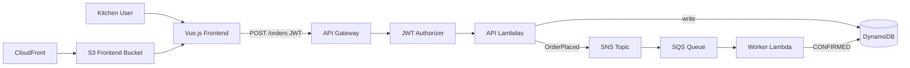

# Food Ordering — Serverless API + Vue Frontend

A kitchen ingredient ordering demo built for the Collectiv Food interview stack: **Vue.js**, **Node.js/TypeScript**, **AWS Lambda**, **API Gateway**, **DynamoDB**, **SNS/SQS**, **Terraform**, and **GitHub Actions CI**.

## Architecture



## Features

- **POST /orders** — place an ingredient order (JWT required)
- **GET /orders/{id}** — fetch order by ID
- **GET /orders** — list all orders
- **Vue.js UI** — place orders, save a JWT, refresh live order status
- **Async processing** — SNS publishes `OrderPlaced`, SQS triggers worker Lambda to confirm orders
- **JWT auth** — Lambda authorizer validates Bearer tokens
- **SOLID design** — handlers → services → repositories
- **Unit tests** — Jest with mocked AWS clients

## Tech stack

| Layer | Technology |
|-------|------------|
| Frontend | Vue 3, Vite, TypeScript |
| Frontend hosting | S3 + CloudFront |
| Runtime | Node.js 20, TypeScript |
| Compute | AWS Lambda |
| API | API Gateway HTTP API |
| Database | DynamoDB (on-demand) |
| Messaging | SNS + SQS (+ DLQ) |
| IaC | Terraform |
| CI | GitHub Actions |
| Auth | JWT (jsonwebtoken) |

## Quick start (local)

```bash
npm install
npm --prefix frontend install
npm run ci          # backend lint + typecheck + test + build, then frontend build
```

Run the frontend locally:

```bash
npm --prefix frontend run dev
```

## Deploy to AWS

### Prerequisites

1. [AWS CLI](https://aws.amazon.com/cli/) configured (`aws configure`)
2. [Terraform](https://www.terraform.io/downloads) >= 1.0
3. Node.js 20+

### Steps

```bash
# 1. Build Lambda bundles and Vue frontend
npm run build
npm --prefix frontend run build

# 2. Configure secrets
cp terraform/terraform.tfvars.example terraform/terraform.tfvars
# Edit jwt_secret to a long random string

# 3. Deploy infrastructure
cd terraform
terraform init
terraform plan
terraform apply

# 4. Note the API and frontend outputs
terraform output api_url
terraform output frontend_bucket_name
terraform output frontend_url
```

Upload the Vue build to S3:

```bash
aws s3 sync frontend/dist "s3://$(terraform -chdir=terraform output -raw frontend_bucket_name)" --delete
```

### Generate a test JWT

```bash
# Use the same secret as in terraform.tfvars
$env:JWT_SECRET="your-secret-from-tfvars"
node scripts/generate-token.js demo-kitchen
```

### Smoke test

```bash
API_URL=$(terraform -chdir=terraform output -raw api_url)
TOKEN=$(node scripts/generate-token.js demo-kitchen)

# Create order
curl -X POST "$API_URL/orders" \
  -H "Authorization: Bearer $TOKEN" \
  -H "Content-Type: application/json" \
  -d '{"items":[{"name":"Tomatoes","quantity":10,"unit":"kg"}],"deliveryDate":"2026-07-15T09:00:00.000Z"}'

# List orders
curl -H "Authorization: Bearer $TOKEN" "$API_URL/orders"

# Get order (replace ORDER_ID)
curl -H "Authorization: Bearer $TOKEN" "$API_URL/orders/ORDER_ID"
```

After a few seconds, the worker Lambda processes the SQS message and updates the order status from `PENDING` to `CONFIRMED`.

## Project structure

```
src/
  handlers/       # Lambda entry points
  services/       # Business logic
  repositories/   # DynamoDB access
  lib/            # Auth, validation, responses
  types/          # Domain types
frontend/
  src/             # Vue components, API client, frontend types
tests/            # Jest unit tests
terraform/        # AWS infrastructure
.github/workflows/ci.yml
```

## Interview talking points

1. **Domain fit** — mirrors Collectiv Food's supply chain: kitchens place orders, events flow async through messaging
2. **Full-stack AWS demo** — Vue.js hosted on S3/CloudFront calls a serverless TypeScript API
3. **SOLID** — `OrderService` depends on `OrderRepository` interface, not DynamoDB directly
4. **TDD** — validation and service logic covered by unit tests before integration
5. **Event-driven** — SNS decouples API from fulfilment; SQS gives retries + DLQ for failed messages
6. **Security** — JWT authorizer on all routes; secrets via Terraform variables (not hardcoded)
7. **CI/CD** — GitHub Actions builds and verifies both backend and frontend
8. **Cost** — serverless + on-demand DynamoDB stays within AWS free tier for demos

## Cleanup

```bash
cd terraform
terraform destroy
```

## License

MIT
